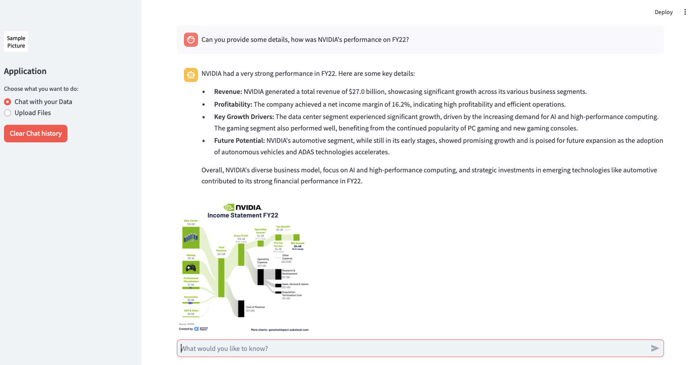
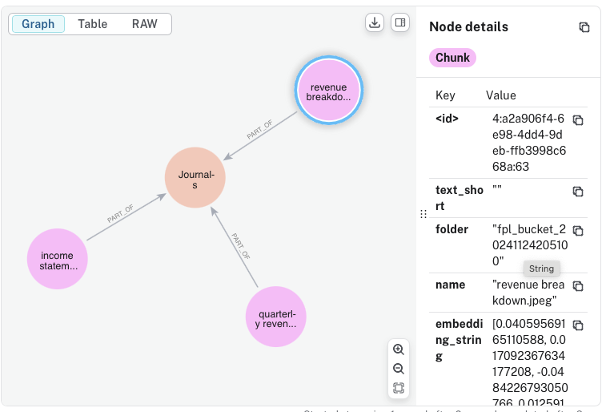

# Multimodal RAG 

This repository shows an example of building a multimodal RAG based on a graph database and using Google Cloud Platform and Gemini LLM models. The user can import data, which may include PDF documents and images. Other input formats and other modalities, such as audio and video, can also be easily added. The prediction output or result can also contain text and images, depending on whether the image content is relevant to the question.



## General process

If the input format is just an image, LLM reads the content of the image. If the input is a PDF document, LLM first finds and reads the images from the document, then reads the text from the PDF file and adds a short summary of the image to the page on which the image is located in the document. It creates consecutive text snippets (chunks) from the PDF pages of the document, which are stored in nodes in the database. The text chunks partially overlap with the next page. Each page is created with its own embedded description, which is stored in the node. When information is retrieved from the RAG using the LLM, relevant text chunks are identified by using these embeddings. For example, the program finds the 5 most relevant hits and creates a text response from them. In addition, images related to the text are retrieved that contain information relevant to this query.

The graph database looks like the following when it includes 3 images.



## Setup

Clone the code, create a Python environment, and run the requirements

```console
python -m venv .venv
source .venv/bin/activate
pip install -r requirements.txt
```

Configure your GCP environment and generate API keys. The GCP configuration is stored in the account.json file. In this example, we have used Gemini 1.5 Pro for reading images and Gemini 1.5 Flash for predictions. Copy the .env.sample file to the .env file and add the parameters to it. If you want to run a Dockerfile, copy env.yaml.sample as env.yaml and add the same parameters to it. 

## Usage
Once the parameters are set, the application will run as

```console
streamlit run app.py
```
You can import files into RAG and then query them using Gemini. The files are stored in a GCP bucket.
